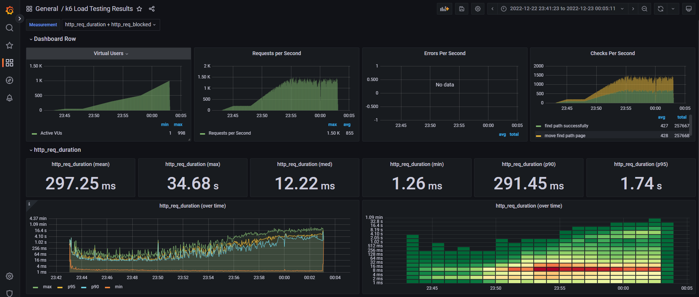
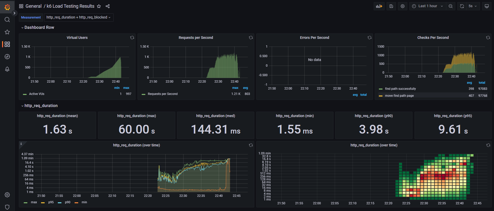

<p align="center">
    
</p>
<p align="center">
  
  
  <a href="https://edu.nextstep.camp/c/R89PYi5H" alt="nextstep atdd">
    
  </a>
  
</p>

<br>

# 인프라공방 샘플 서비스 - 지하철 노선도

<br>

## 🚀 Getting Started

### Install
#### npm 설치
```
cd frontend
npm install
```
> `frontend` 디렉토리에서 수행해야 합니다.

### Usage
#### webpack server 구동
```
npm run dev
```
#### application 구동
```
./gradlew clean build
```
<br>

## 미션

* 미션 진행 후에 아래 질문의 답을 작성하여 PR을 보내주세요.


### 1단계 - 화면 응답 개선하기
1. 성능 개선 결과를 공유해주세요 (Smoke, Load, Stress 테스트 결과)

* http_req_duration
  * smoke: 21.12ms > 17.9ms(-3.22ms) 
  * load: 145.05ms > 55.84ms(-89.21ms)
  * stress: 1060ms > 540.68ms(-519.32ms)

### Smoke
<table>
    <thead>
        <tr>
            <td>before</td>
            <td>after</td>
        </tr>
    </thead>
    <tbody>
        <tr>
            <td></td>
            <td></td>
        </tr> 
        <tr>
            <td></td>
            <td></td>
        </tr>
    </tbody>
</table>

### Load
<table>
    <thead>
        <tr>
            <td>before</td>
            <td>after</td>
        </tr>
    </thead>
    <tbody>
        <tr>
            <td></td>
            <td></td>
        </tr> 
        <tr>
            <td></td>
            <td></td>
        </tr>
    </tbody>
</table>

### Stress
<table>
    <thead>
        <tr>
            <td>before</td>
            <td>after</td>
        </tr>
    </thead>
    <tbody>
        <tr>
            <td></td>
            <td></td>
        </tr> 
        <tr>
            <td></td>
            <td></td>
        </tr>
    </tbody>
</table>


2. 어떤 부분을 개선해보셨나요? 과정을 설명해주세요
### 개선 항목 별 부하테스트
#### gizp 적용
* Smoke


* Load


* Stress


* pagespeed


#### cache 적용
* Smoke


* Load


* Stress


* pagespeed


#### http2 적용
* Smoke


* Load


* Stress


* pagespeed


---

### 2단계 - 스케일 아웃

1. Launch Template 링크를 공유해주세요.

[Launch Template Link](https://ap-northeast-2.console.aws.amazon.com/ec2/v2/home?region=ap-northeast-2#LaunchTemplateDetails:launchTemplateId=lt-0428e884d65640ef9)

2. cpu 부하 실행 후 EC2 추가생성 결과를 공유해주세요. (Cloudwatch 캡쳐)

```sh
$ stress -c 2
```


---

3. 성능 개선 결과를 공유해주세요 (Smoke, Load, Stress 테스트 결과)

### Smoke
* auto scaling 인스턴스 변화 없음(수행 인스턴스: 1개)

<table style="text-align: center">
    <thead>
        <tr>
            <td>k6</td>
            <td>grafana</td>
        </tr>
        <tr>
            <td colspan="2">cloud watch</td>
        </tr>
    </thead>
    <tbody>
        <tr>
            <td></td>
            <td></td>
        </tr>
        <tr>
            <td colspan="2"></td>
        <tr>
    </tbody>
</table>

### Load

<table style="text-align: center">
    <thead>
        <tr>
            <td>k6</td>
            <td>grafana</td>
        </tr>
        <tr>
            <td colspan="2">cloud watch</td>
        </tr>
    </thead>
    <tbody>
        <tr>
            <td></td>
            <td></td>
        </tr>
        <tr>
            <td colspan="2"></td>
        <tr>
    </tbody>
</table>

* load test 2
  * ASG 인스턴스 설정: 최소: 3개, 최대 10개
<table style="text-align: center">
    <thead>
        <tr>
            <td>k6</td>
            <td>grafana</td>
        </tr>
        <tr>
            <td colspan="2">cloud watch</td>
        </tr>
    </thead>
    <tbody>
        <tr>
            <td></td>
            <td></td>
        </tr>
        <tr>
            <td colspan="2"></td>
        <tr>
    </tbody>
</table>

### Stress
* CPU 이용률이 50%를 초과하여 인스턴스 3개 auto scaling(수행 인스턴스: 4개)

<table style="text-align: center">
    <thead style="text-align: center">
        <tr>
            <td>k6</td>
            <td>grafana</td>
        </tr>
        <tr>
            <td colspan="2">cloud watch</td>
        </tr>
    </thead>
    <tbody>
        <tr>
            <td></td>
            <td></td>
        </tr> 
        <tr>
            <td colspan="2"></td>
        <tr>
    </tbody>
</table>

### 종합

- 목표 응답 시간: 0.5s 이내
  - 경로 탐색 페이지 > 경로 탐색 기능
- VUser(max)
  - Smoke: 1명
  - Load: 100명
  - Stress: 1000명

| p(95) | ASG 설정 전 | rps(VUser / T) | ASG 설정 후 | rps(VUser / T) |
| --- | --- | --- | --- | --- |
| Smoke | 49.01ms | 1 / 0.049 = 20 | 60.01ms | 1 / 0.06 = 16 |
| Load | 218.28ms | 100 / 0.218 = 458 | 84.22ms | 100 / 0.084 = 1,190 |
| Stress | 4.28s | 1000 / 4.28 = 233 | 3.68s | 1000 / 3.68 = 271 |

| http_req_duratioin(avg) | ASG 설정 전 | rps(VUser / T) | ASG 설정 후 | rps(VUser / T) |
| --- | --- | --- | --- | --- |
| Smoke | 17.9ms | 1 / 0.017 = 58 | 28.48ms | 1 / 0.028 = 35 |
| Load | 55.84ms | 100 / 0.055 = 1,818 | 57.72ms | 100 / 0.057 = 1,754 |
| Stress | 540.68ms | 1000 / 0.54 = 1,851 | 693.49ms | 1000 / 0.693 = 1,443 |

* p(95) 수치 기준으로 분석했을 때 rps가 개선됨을 확인
* 다만, http_req_duration(avg) 수치 기준으로 분석했을 때 지연률이 늘어났음을 확인할 수 있다.
  * ASG로 인해 latency가 생긴 것인지 의문

### 3단계 - 쿠버네티스로 구성하기
1. 클러스터를 어떻게 구성했는지 알려주세요~ (마스터 노드 : n 대, 워커 노드 n대)
마스터 노드 : 1대, 워커 노드 3대

2. 스트레스 테스트 결과를 공유해주세요 (기존에 container 한대 운영시 한계점도 같이 공유해주세요)

* container: 10대




* container: 1대




#### 결론
* 하나의 컨테이너로 운영하는 경우, 컨테이너에 부하가 증가하면서 응답 지연 발생 확인
* 여러 컨테이너로 운영하는 경우, 요청이 많아짐에 따라 로드밸런서가 각 컨테이너에 부하분산하여 빠른 응답 시간 확인

3. 현재 워커노드에서 몇대의 컨테이너를 운영중인지 공유해주세요
10대


---

### [추가] WAS 개선하기

1. springboot에 HTTP Cache, gzip 설정하기

2. Data Cache 설정하기

---

### [추가] 클러스터 운영하기
1. kibana 링크를 알려주세요

2. grafana 링크를 알려주세요

3. 지하철 노선도는 어느정도로 requests를 설정하는게 적절한가요?

4. t3.large로 구성할 경우 Node의 LimitRange, ResourceQuota는 어느정도로 설정하는게 적절한가요?

5. 부하테스트를 고려해볼 때 Pod은 몇대정도로 구성해두는게 좋다고 생각하나요?

6. Spinaker 링크를 알려주세요.
